# Css Properties
1.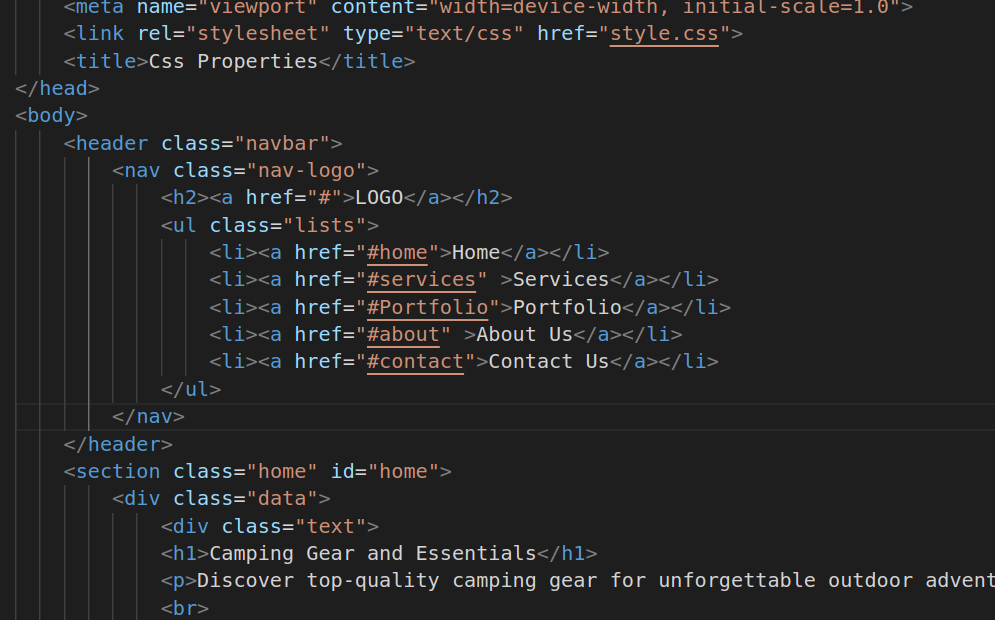

2.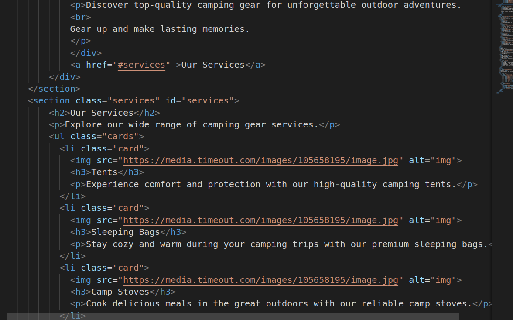

* link rel: This link tag is used to link an external CSS (Cascading Style Sheet) file named "style.css" to style the webpage's elements.
* header class="navbar": Defines a header section with the class "navbar" that typically contains navigation elements.
* nav class="nav-logo": Defines a navigation section with the class "nav-logo" for navigation links.
* h2: A level 2 headig.
* ul class="lists": Defines an unordered list with the class "lists" for the navigation links.
* section class="home" id="home": Defines a section with the class "home" and an id of "home." Sections are used to structure and group content on the webpage.
* div class="data": A div element with the class "data" that groups content within the "Home" section.
* div class="text": A div element with the class "text" used to contain text content within the "Home" section.
* h1: A level 1 heading representing the main title of the "Home" section.
* p: A paragraph element used to display text content within the "Home" section.
* a: A link that redirects the user to the "Services" section when clicked. It has an href attribute specifying the target location.
* section class="services": Defines the "Services" section with the class "services" and an id of "services."
* h2: A level 2 heading representing the title of the "Services" section.
* p: A paragraph element used to display text content within the "Services" section.
* ul class="card": An unordered list with the class "cards" that is likely used to structure and style a list of service cards.
* li class="card": A list item with the class "card" that represents an individual service card.
* img: An image element that displays an image with a specified source and alternative text.
* h3: A level 3 heading representing the title of a service.
* p: A paragraph element used to display a description of the service.

3.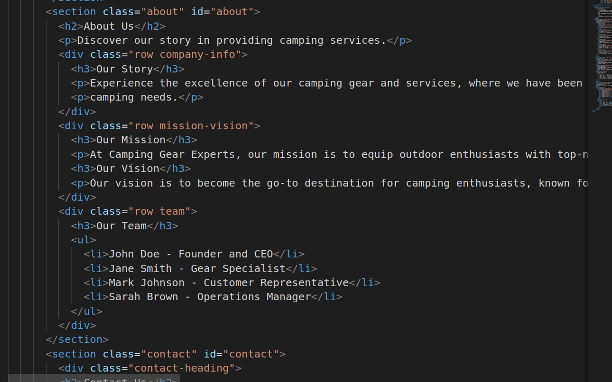

4.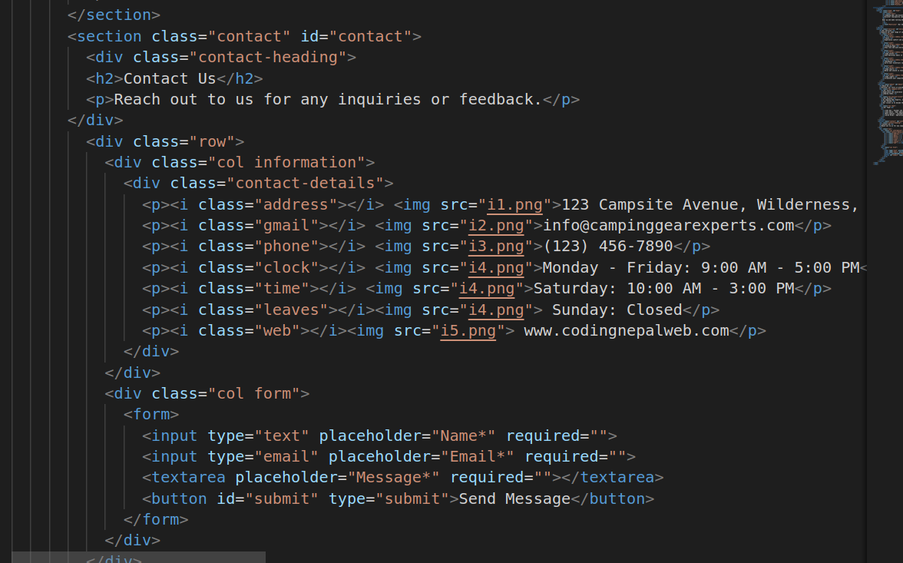

* section class="about" id="about": Defines the "About Us" section with the class "about" and an id of "about."
* h2: A level 2 heading representing the title of the "About Us" section.
* p: A paragraph element used to display text content within the "About Us" section.
* div class="row company-info": A div element with the class "row company-info" that likely represents a subsection within the "About Us" section.
* h3: A level 3 heading representing the title of a subsection.
* ul: An unordered list element, possibly used to list information.
* li: A list item element, used to list individual items within an unordered list.
* form: A form element used to create a web form for user input.
* input type="text" placeholder="Name*" required="": An input field for entering a name, with a placeholder and "required" attribute to make it mandatory.
* button id="submit" type="submit">Send Message: A button element within the form used for submitting the form.

5.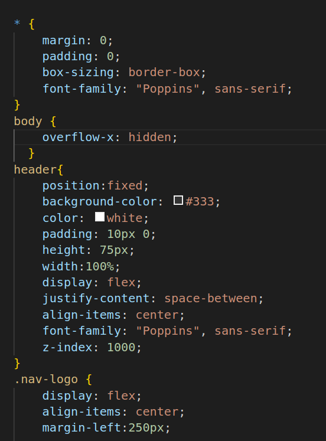

6.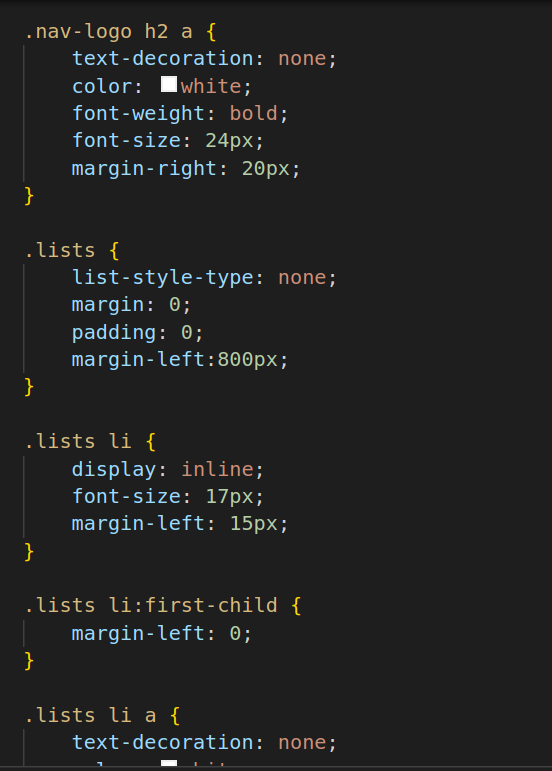

* *: The asterisk is a universal selector, targeting all elements on the page.
* margin: 0: Sets the margin of all elements to zero, removing any default spacing outside elements.
* padding: 0: Sets the padding of all elements to zero, removing any default spacing inside elements.
* box-sizing: border-box: Ensures that the total width and height of an element include padding and border.
* font-family: "Poppins", sans-serif: Specifies the font family to be used for all text on the page, with a fallback to a generic sans-serif font.
* body: Selects the body element.
* overflow-x: hidden: Hides the horizontal scrollbar, preventing horizontal scrolling.
* osition: fixed: Fixes the header at the top of the viewport, so it remains visible even when scrolling.
* background-color: #333: Sets the  background color of the header.
* color: white: Sets the text color in the header to white.
* padding: 10px 0: Adds padding to the top and bottom of the header.
* height: 75px: Sets the height of the header.
* width: 100%: Makes the header span the entire width of the viewport.
* display: flex: Uses the Flexbox layout for positioning header contents.
* justify-content: space-between;: Positions header content with space between them horizontally.
* align-items: center: Vertically centers header content.
* font-family: "Poppins", sans-serif;: Specifies the font family for header text.
* z-index: 1000: Sets the stacking order of the header to ensure it's above other elements.
* .nav-logo: Selects elements with the class "nav-logo."
* display: flex: Uses Flexbox to arrange child elements.
* align-items: center: Vertically centers child elements.
* margin-left: 250px: Adds left margin to create space from the left edge of the header.
* nav-logo h2 a: Selects the anchor element within an h2 inside elements with the class "nav-logo."
* text-decoration: none: Removes underlines from anchor text.
* color: white: Sets the text color to white.
* font-weight: bold: Makes the text bold.
* font-size: 24px: Sets the font size.
* margin-right: 20px: Adds right margin to create space between the logo and navigation links.
* lists: Selects elements with the class "lists."
* list-style-type: none: Removes bullet points from list items.
* margin: 0: Removes default margins.
* padding: 0: Removes default padding.
* margin-left: 800px: Adds left margin to create space for the navigation list.
* lists li: Selects the list items within elements with the class "lists."
* display: inline: Makes list items display as inline elements, placing them side by side horizontally.
* font-size: 17px: Sets the font size for list items.
* margin-left: 15px: Adds left margin to create space between list items.

7.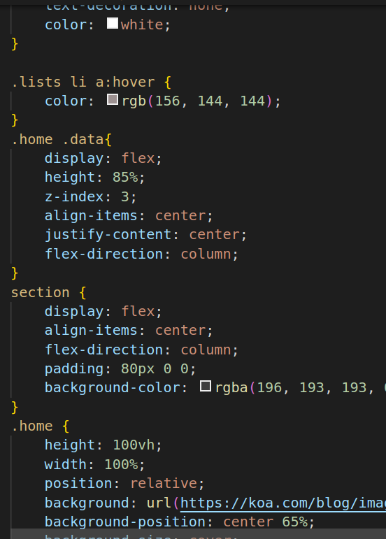

8.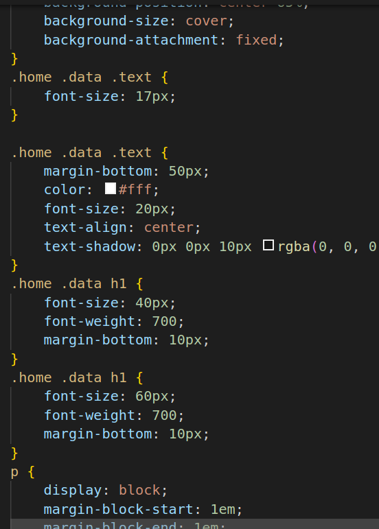

9.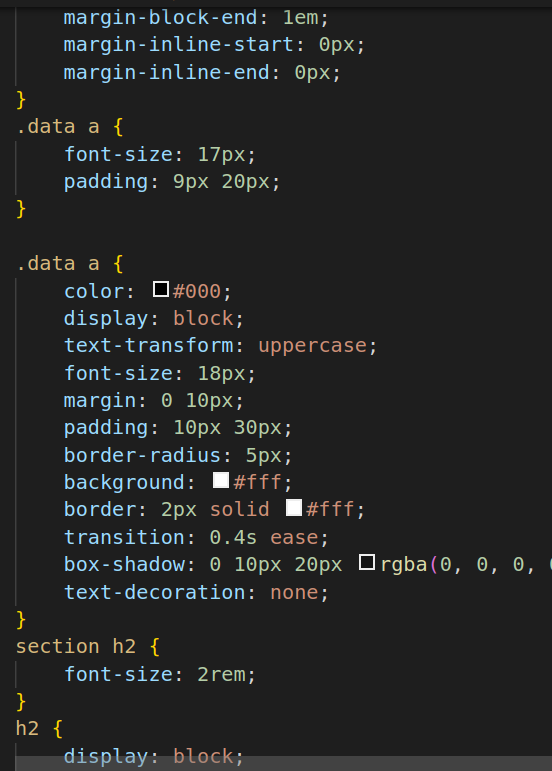

* lists li:first-child: Selects the first list item within elements with the class "lists."
* margin-left: 0: Removes the left margin from the first list item to eliminate spacing.
* lists li a: Selects anchor elements within list items.
* text-decoration: none;: Removes underlines from anchor text.
* color: white: Sets the text color of anchor elements to white.
* lists li a:hover: Styles anchor elements when hovered.
* color: rgb(156, 144, 144): Changes the text color to a specific shade of gray when hovered.
* home .data: Selects elements with the class "data" inside elements with the class "home."
* display: flex: Uses Flexbox for layout.
* height: 85%: Sets the height of the element to 85% of its parent container.
* z-index: 3: Sets the stacking order to ensure this element appears above others.
* align-items: center: Vertically centers child elements.
* justify-content: center: Horizontally centers child elements.
* flex-direction: column: Stacks child elements vertically.
* section: Selects elements.
* display: flex: Uses Flexbox for layout.
* align-items: center: Vertically centers child elements.
* flex-direction: column: Stacks child elements vertically.
* padding: 80px 0 0: Adds padding to the top.
* background-color: rgba(196, 193, 193, 0.2): Sets the background color with transparency.
* home: Selects elements with the class "home."
* height: 100vh: Sets the height to 100% of the viewport height, ensuring the element covers the entire screen vertically.
* width: 100%: Sets the width to 100% of the parent container, making it span the full width of the viewport.
* position: relative: Establishes a positioning context for child elements.
* background: Adds a background image to the element.
* background-position: center 65%;: Positions the background image horizontally centered and 65% down from the top.
* background-size: cover: Scales the background image to cover the entire element.
* background-attachment: fixed;: Makes the background image fixed, so it doesn't scroll with the content.
* .home .data .text: Selects text elements within elements with classes "home" and "data."
* font-size: 17px: Sets the font size for this text.
* home .data h1: Selects heading elements h1 within elements with classes "home" and "data."
* font-size: 40px: Sets the font size for these headings.
* font-weight: 700: Sets the font weight to bold.
* margin-bottom: 10px: Adds bottom margin to create space below the headings.
* data a: Selects anchor a elements within elements with the class "data."
* font-size: 17px: Sets the font size for these anchor elements.
* padding: 9px 20px: Adds padding to the anchor elements.
* section h2: Selects heading elements h2 within section elements.
* font-size: 2rem: Sets the font size for these headings.
* h2: Selects all h2 elements in the HTML document.
* display: block: Sets the display property to "block," which is the default display value for headings. This ensures that the h2 elements are displayed as blocks.
* font-size: 1.5em: Sets the font size of h2 elements to 1.5 times the current font size.
* margin-block-start: 0.83em; and margin-block-end: 0.83em: Sets the top and bottom margins for h2 elements, controlling the spacing above and below the headings.
* margin-inline-start: 0px; and margin-inline-end: 0px: Sets the left and right margins for h2 elements to zero, ensuring no additional horizontal spacing.
* text-align: center: Sets the text alignment of these p elements to center, horizontally aligning the text within the parent.
* p: Selects all p elements in the HTML document.
* display: block: Sets the display property to "block" for p elements, ensuring they are displayed as blocks.
* margin-block-start: 1em; and margin-block-end: 1em: Sets the top and bottom margins for p elements, controlling the spacing above and below the paragraphs.
* margin-inline-start: 0px; and  margin-inline-end: 0px: Sets the left and right margins for p elements to zero.
* line-height: 1: Sets the line height of p elements to 1, which means the lines of text within the paragraphs have no extra vertical spacing.
* section .cards: Selects elements with the class "cards" that are descendants of elements.
* display: flex: Sets the display property to "flex" for these elements, enabling flexbox layout.
* flex-wrap: wrap: Allows the flex items to wrap to the next line if they exceed the container's width.
* max-width: 1200px: Sets the maximum width for these elements to 1200 pixels.
* margin-top: 50px: Adds top margin to create space between these elements and their parent.
* padding: 0 10px: Adds padding to the left and right sides of these elements.
* justify-content: space-between: Distributes the flex items with space between them horizontally.

10.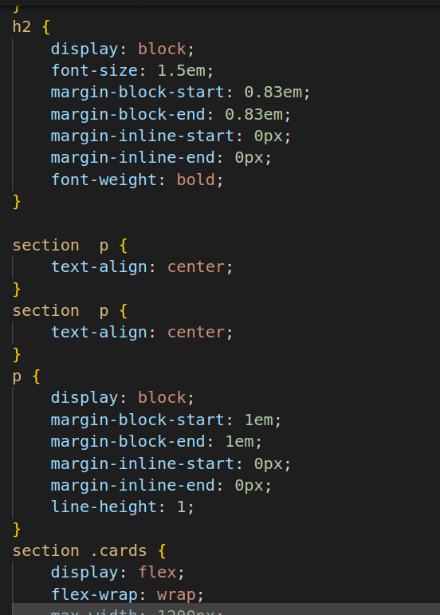

11.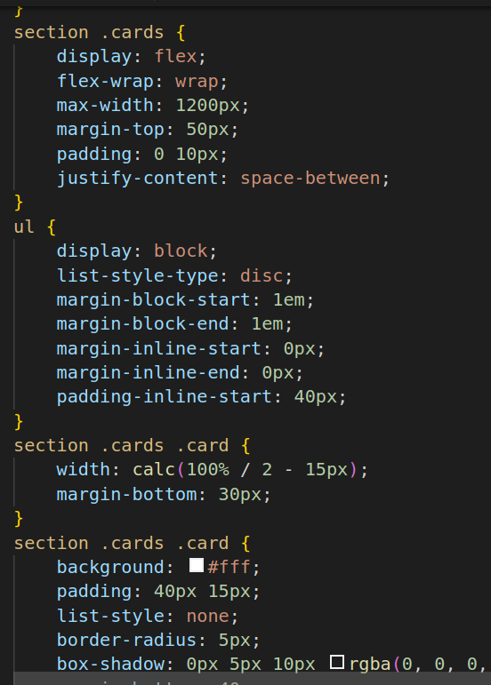

12.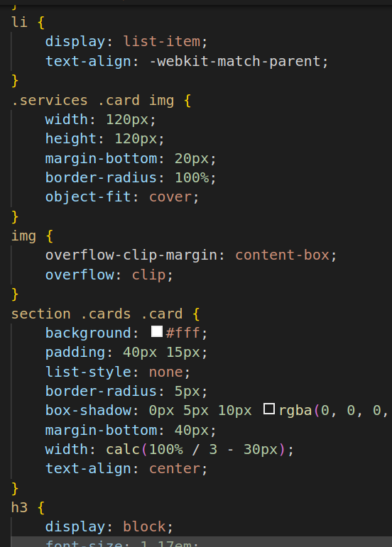

13.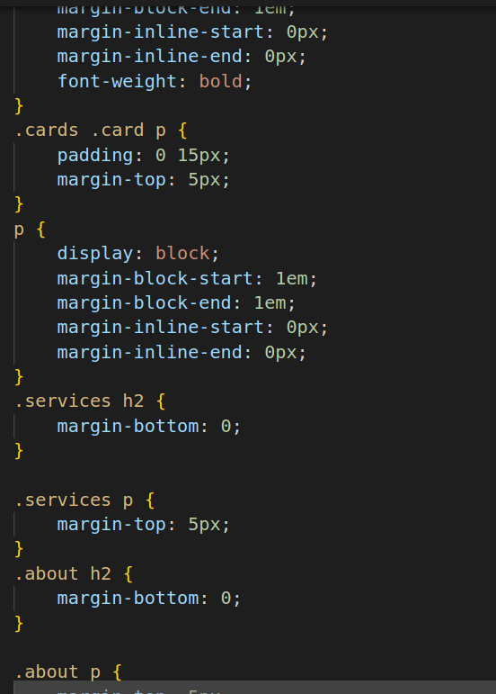

14.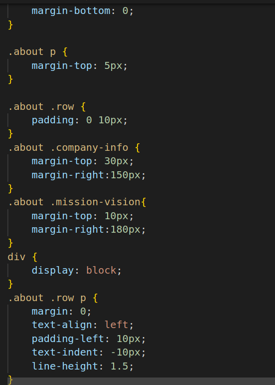

15.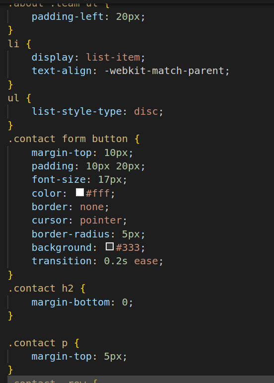

* contact .col.information: Selects elements with the class "col" that are descendants of elements with the class "contact," and specifically targets those with the class "information."
* flex: 1: This property sets the flex property of these elements to "1," which means they will take up equal amounts of available horizontal space within their parent container. This is often used in flexbox layouts to distribute space evenly.
* contact .col.information .contact-details p: Selects p elements that are descendants of elements with the class "contact-details," which are themselves descendants of elements with the class "col" and the class "information."
* text-align: left: Sets the text alignment of these p elements to the left, ensuring that the text within them is left-aligned within their containers.
* contact .col.form form: Selects form elements that are descendants of elements with the class "form," which are themselves descendants of elements with the class "col" and the class "contact."
* width: 100%: This property sets the width of these form elements to 100% of their parent container's width, making them expand to fill the available horizontal space.
* margin-left: 600px;: Adds a left margin of 600 pixels to these form elements. This might be used for layout purposes to position the form.
* margin-top: -300px: Adds a negative top margin of 300 pixels to these form elements. Negative margins can be used to move elements upward, likely for layout positioning.
* contact form input: Selects input elements that are descendants of form elements within the "contact" section.
These properties are used to style the input fields within the form. They set the height, margin at the bottom, padding, width, font size, and border properties for these input elements.
* contact form textarea: Selects textarea elements that are descendants of form elements within the "contact" section.
* contact .row .col:last-child: Selects the last element with the class "col" that is a descendant of an element with the class "row" within the "contact" section.
* margin-top: 40px: Adds a top margin of 40 pixels to this last column within the row. This margin might be used to create space below this specific column.
* ontact .row .col: Selects all elements with the class "col" that are descendants of elements with the class "row" within the "contact" section.

16.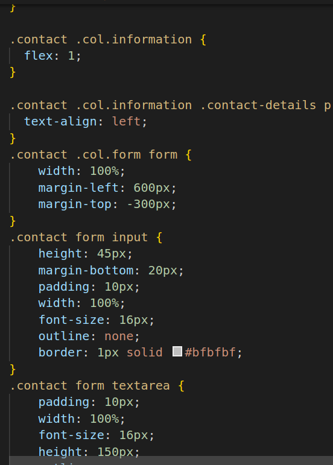

* width: 100%: This rule sets the width of the form element to 100% of its container's width. It ensures that the form spans the entire width of its parent container, likely for responsive design purposes.
* margin-left: 600px: This rule adds a left margin of 600 pixels to the form element. It may be used to position the form 600 pixels from the left edge of its container, creating a specific layout.
* margin-top: -300px: This rule adds a negative top margin of 300 pixels to the form element.
* height: 45px;: Sets the height of the input elements to 45 pixels.
* margin-bottom: 20px: Adds a margin of 20 pixels at the bottom of each input element, creating space between them.
* padding: 10px: Provides 10 pixels of padding within each input element, creating internal spacing.
* width: 100%: Ensures that the input elements span the entire width of their container.
* font-size: 16px: Sets the font size for text within the input elements to 16 pixels.
* outline: none: Removes the default outline or border when the input element is focused.
* border: 1px solid : Adds a 1-pixel solid border to each input element with a light gray color.
* padding: 10px: Adds 10 pixels of padding inside each textarea element.
* width: 100%: Makes the textarea elements span the entire width of their container.
* font-size: 16px: Sets the font size for text within the textarea elements to 16 pixels.
* height: 150px: Sets the initial height of the textarea elements to 150 pixels.
* outline: none: Removes the default outline or border when the textarea element is focused.
* resize: vertical: Allows vertical resizing of the textarea element by the user.
* border: 1px solid: Adds a 1-pixel solid border to each textarea element with a light gray color.
* margin-top: 40px: Adds a top margin of 40 pixels to this last column within the row. This margin might be used to create space below this specific column, separating it from the elements above it.
* width: 100%: Ensures that these columns span the full width of their parent container.
* padding: 0 10px: Adds 10 pixels of padding to the left and right sides of each column.
* width: calc(100% / 2 - 50px): Uses the calc() function to calculate the width of each column. It divides the available width by 2 and subtracts 50 pixels from each half. This can be used to create a two-column layout where each column has a specific width.
